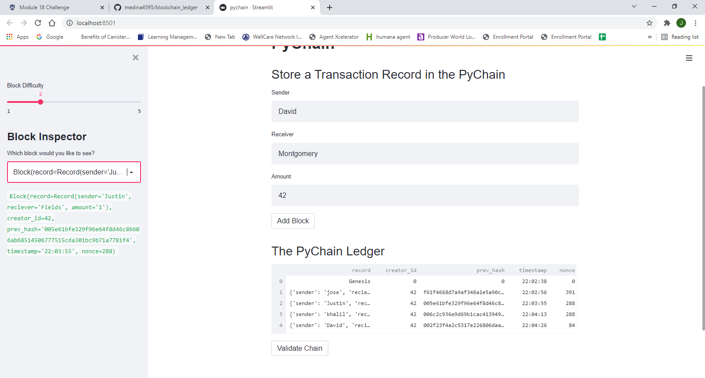
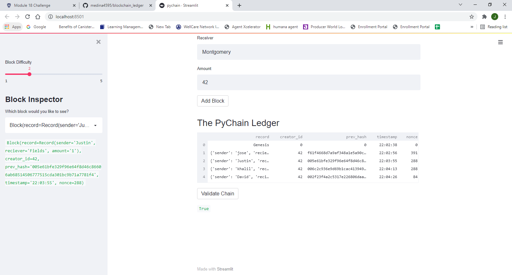

# Blockchain Ledger

Built a python based blockchain leder with a web interface using streamlit to let banks conduct financial transactions while being able to verify the integrity of the data in the ledger.

---

## installation Guide

```python
pip install streamlit
```

---

## Run Application

Run application by entering 
```python
streamlit run pychain.py
```
after moving into the folder containing the python file. Enter info and press add block. Use drop-down menu to view specific block's data. validate chain by pressing validate chain button.

---

## Screen Shots
Shows data in block

Shows the validity of data


---

## Contributors

Jose Medina

---

## License

MIT